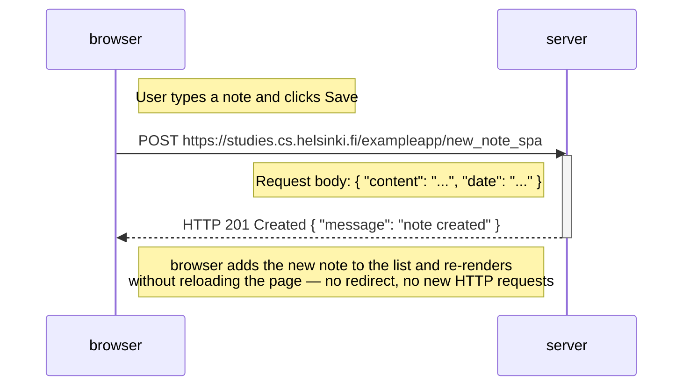

# Exercise 0.6: New Note in Single Page App Diagram

Sequence diagram showing what happens when a user creates a new note in the SPA version.

```mermaid
sequenceDiagram
    participant browser
    participant server

    Note right of browser: User types a note and clicks Save

    browser->>server: POST https://studies.cs.helsinki.fi/exampleapp/new_note_spa
    activate server
    Note left of server: Request body: { "content": "...", "date": "..." }
    server-->>browser: HTTP 201 Created { "message": "note created" }
    deactivate server

    Note right of browser: browser adds the new note to the list and re-renders<br/>without reloading the page — no redirect, no new HTTP requests
```
